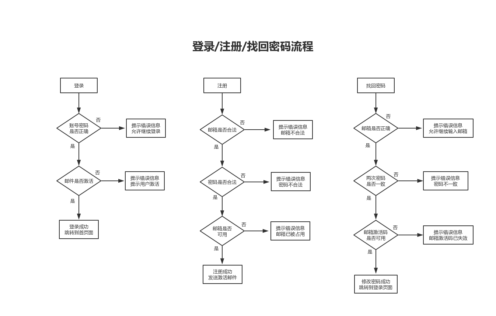

# 1. 登录/注册/找回密码流程图



# 2. 表单校验

+ 表单校验可以采用 Django 自带的表单校验功能，这个功能需要创建一个表单类，继承 Django 自带的 forms.Form 类
+ 在创建的表单类里，自定义表单的校验信息，包括字段是否必填，长度，类型，错误信息等
+ 用 TestForm 测试表单校验来举例

```python
from django import forms


class TestForm(forms.Form):
    username = forms.EmailField(required=True, error_messages='用户名不能为空')
    password = forms.CharField(required=True, min_length=8, error_messages='密码长度不能小于 8 位')
```

+ 在需要用到表单的地方使用这个表单，这里的 test_form 就会校验请求信息，把这个 test_form 渲染到页面上，在页面上就会在页面上显示相应的信息

```python
from django.shortcuts import render
from django.views.generic import View

from .forms import TestForm

class TestView(View):
    def get(self, request):
        test_form = TestForm(request.GET)
        return render(request, 'test.html', {
            'test_form': test_form
        })
```

+ 页面模板信息，这里的 captcha 是需要使用 django-simple-captcha 这个库，使用起来比较简单，直接看文档就可以

```jinja2
<form method="post" action="/test/">
    
    <div>
      <label>username</label>
    
      <input type="text" id="username" name="username"
             value="{{ test_form.username.value }}"/>
    </div>

    <div>
      <label>captcha1</label>
      {{ test_form.captcha }}
    </div>
    
    <div>
      
        {{ error }}
      
    </div>
    
    <input class="btn btn-green" type="submit" value="click"/>

</form>
```

# 3. 登录/注册/找回密码功能

## 3.1 登录 GET/POST

+ 其实这里边这些没什么好说的，都是简单的 get 和 post 请求，根据不同类型的请求做出不同的响应
+ 根据请求信息，对数据库进行查询/写入操作，然后 return 相应的页面，把对应的数据信息写到页面上

```python
class LoginView(View):
    def get(self, request):
        return render(request, 'login.html', {})

    def post(self, request):
        login_form = LoginForm(request.POST)
        if login_form.is_valid() is not True:
            return render(request, 'login.html', {
                'login_form': login_form
            })
        else:
            username = request.POST.get('username', '')
            password = request.POST.get('password', '')
            user = authenticate(username=username, password=password)
            if user is not None:
                login(request, user)
                return render(request, 'index.html')
            else:
                return render(request, 'login.html', {
                    'login_form': login_form
                })
```

## 3.2 登录功能修改

+ Django 默认的是用户名和密码登录，但是我们可以使用 用户名+密码 或 邮箱+密码登录
+ 在 users/views.py 里添加验证的类，这个类要在 settings.py 里进行调用
+ users/views.py

```python
from django.contrib.auth.backends import ModelBackend
from django.db.models import Q

from .models import UserProfile

class CustomBackend(ModelBackend):
    def authenticate(self, request, username=None, password=None, **kwargs):
        try:
            user = UserProfile.objects.get(Q(username=username) | Q(email=username))
            if user.check_password(password):
                return user
        except Exception as e:
            return None
``` 

+ settings.py

```python
AUTHENTICATION_BACKENDS = (
    'users.views.CustomBackend',
)
```

## 3.3 发送邮件

+ 发送邮件功能是 Django 自带的功能，可以直接使用
+ 在 settings.py 里设置邮件信息

```python
from config_env import EMAIL_INFO


EMAIL_HOST = EMAIL_INFO['EMAIL_HOST']

EMAIL_PORT = EMAIL_INFO['EMAIL_PORT']

EMAIL_HOST_USER = EMAIL_INFO['EMAIL_HOST_USER']

EMAIL_HOST_PASSWORD = EMAIL_INFO['EMAIL_HOST_PASSWORD']

EMAIL_USE_TLS = EMAIL_INFO['EMAIL_USE_TLS']

EMAIL_FROM = EMAIL_INFO['EMAIL_FROM']
```

+ 封装一个 send_email 的方法，直接调用就可以

# 4. 压缩 html 代码

+ 使用 django-htmlmin 压缩 html 代码
+ 修改 settings.py，把这个中间件添加到 MIDDLEWARES 里

```python

HTML_MINIFY = True

MIDDLEWARE = [
    'htmlmin.middleware.HtmlMinifyMiddleware',
    'htmlmin.middleware.MarkRequestMiddleware',
]
```

